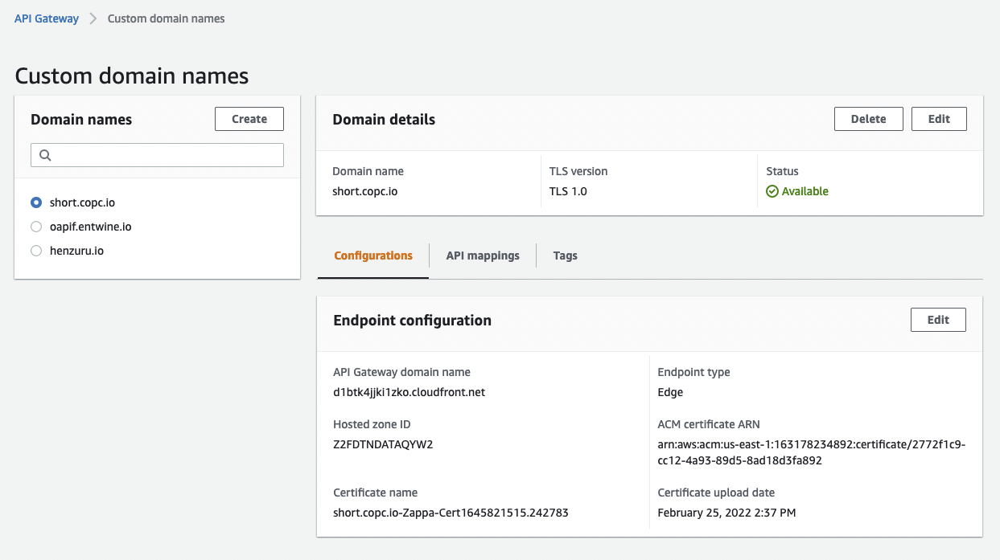

# short.copc.io

This infrastructure is a simple Flask app that uses DynamoDB for viewer.copc.io state URLs


## Setup


### Conda environment

```
conda create -n copc-urls -c conda-forge python=3.9 -y
conda env config vars set -n copc-urls AWS_ACCESS_KEY_ID=thekey
conda env config vars set -n copc-urls AWS_SECRET_ACCESS_KEY=thesecret
conda env config vars set -n copc-urls AWS_DEFAULT_REGION=us-west-2
conda activate copc-urls

pip install virtualenv
```

### Setup venv

Create virtual environment
```sh
virtualenv venv
```
Activate virtual environment
```sh
source venv/bin/activate
```
Install dependencies
```sh
pip install -r requirements.txt
```

### Deploy

#### Staging

```sh

zappa deploy staging


```

Staging process will emit logs and give you final APIGW HTTP link you can test against

#### Production


1) Create an SSL certificate in AWS Certificate Manager and get URN. Paste the certificate's URN and URL
into ``zappa_settings.json`` where appropriate.


2) Deploy it

```sh

zappa deploy production

# configure SSL configuration
zappa certify production

# Watch logs
zappa tail production

```

3) Visit APIGW and setup CNAME for CloudFront URL in DNS


